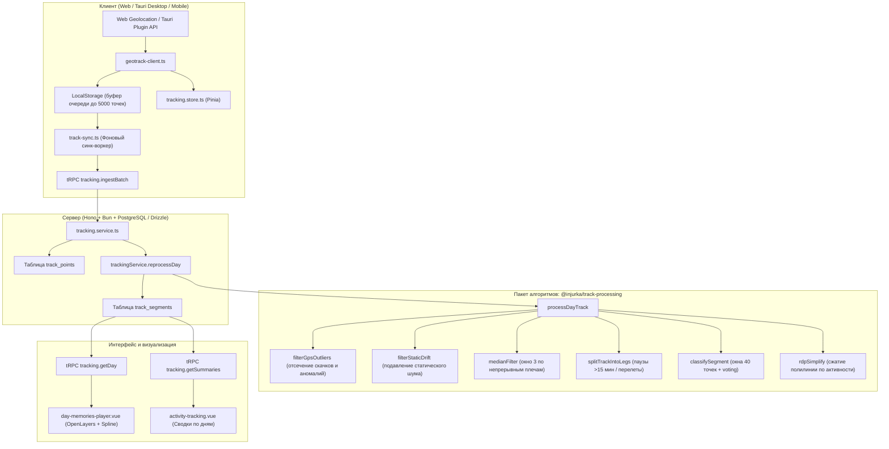

# Activity Tracking (GPS-трекинг и Воспоминания дня)

Модуль непрерывного GPS-трекинга перемещений пользователя, автоматической классификации активности (покой, ходьба, велосипед, автотранспорт, поезд), офлайн-буферизации, пакетной синхронизации с бэкендом и визуализации на интерактивной карте с таймлайн-плеером.

---

## 🏗 Архитектура и поток данных

---

## 🧩 Ключевые компоненты системы

### 1. Клиентский захват и телеметрия ([`geotrack-client.ts`](file:///home/injurka/my/trip-scheduler/apps/client/src/renderer/shared/services/tracking/geotrack-client.ts))

- **Кроссплатформенность:** Автоматически использует `@tauri-apps/plugin-geolocation` в среде мобильного/десктопного приложения и стандартный `navigator.geolocation` в браузере и PWA.
- **Экранная блокировка:** Запрашивает `navigator.wakeLock.request('screen')` для предотвращения засыпания экрана во время активной записи.
- **Первичный отсев шума:**
  - Отсекает фиксы с точностью `accuracy > 140м`.
  - Отсекает статический дрейф на остановках ($< 1.5$ м при скорости $< 0.3$ м/с).
  - Вычисляет скорость и азимут движения при отсутствии аппаратных показаний.
- **Защита от зависания якорной точки:** При серии из 3 последовательно отклоненных точек выполняет автоматическую перекалибровку на свежие координаты (например, после посадки самолета или выхода из подземного перехода).
- **Надежное хранение:** Сохраняет сессию и точки в `LocalStorage` с ограничением в 5000 точек для предотвращения исчерпания дисковой квоты.

### 2. Фоновая синхронизация ([`track-sync.ts`](file:///home/injurka/my/trip-scheduler/apps/client/src/renderer/shared/services/tracking/track-sync.ts))

- Выполняет отправку батчами (по 500 точек) через tRPC-процедуру `tracking.ingestBatch`.
- Идемпотентность: дедупликация точек на сервере по `clientPointId` (`onConflictDoNothing`).
- Защита от спама: не отправляет запросы, если пользователь не авторизован (`authStore.isAuthenticated`).

### 3. Алгоритмическое ядро ([`packages/track-processing`](file:///home/injurka/my/trip-scheduler/packages/track-processing/src/index.ts))

- **`filterGpsOutliers`**: Персентильный и геометрический анализ скорости. Отсекает одиночные «бумеранги» (скачок в сторону и возврат за секунды), сохраняя реальные авиаперелеты и восстанавливая траекторию при ошибочной начальной точке.
- **`filterStaticDrift`**: Схлопывание паразитных флуктуаций покоя в единый якорь.
- **`medianFilter`**: Медианная фильтрация по окну из 3 точек строго внутри непрерывных участков (без сглаживания через временные разрывы).
- **`splitTrackIntoLegs`**: Разделение маршрута на независимые плечи при паузах записи $>15$ минут или скачках $>8$ км.
- **`classifySegment` & `processDayTrack`**:
  - Скользящие окна по 40 точек с шагом 10 точек.
  - Поточечное взвешенное голосование видов активности:
    - `still` — покой ($\le 1.5$ км/ч);
    - `walk` — пешая прогулка ($1.5$–$7$ км/ч);
    - `bike` — велосипед ($8$–$35$ км/ч);
    - `vehicle` — автомобиль / автобус ($7$–$130$ км/ч);
    - `rail` — железнодорожный транспорт (скорость $>45$ км/ч, коэффициент вариации скорости $CV < 0.25$, прямолинейность траектории, редкие остановки).
  - Сегменты формируются без дублирования точек на границах.
  - Точный расчет кинематических параметров (`distanceM`, `durationMs`) до этапа сжатия.
- **`rdpSimplify`**: Адаптивное сжатие полилинии алгоритмом Рамера — Дугласа — Пекера под каждый тип активности (`still`: 5м, `walk`: 3м, `bike`: 5м, `vehicle`: 7м, `rail`: 15м).
- **`centripetalCatmullRom`**: Центростремительный сплайн ($\alpha = 0.5$), гарантирующий гладкость маршрута без паразитных петель и самопересечений.

### 4. Серверный слой ([`apps/server/src/modules/tracking`](file:///home/injurka/my/trip-scheduler/apps/server/src/modules/tracking/tracking.service.ts))

- `ingestBatch`: Прием батчей точек и автоматический фоновый запуск `reprocessDay` для пересчета сегментов поступивших сессий.
- `getDay`: Получение точек и сегментов за заданные календарные сутки UTC.
- `getSummaries`: Агрегированные сводки активности за последние $N$ дней (дистанция, время, распределение по видам транспорта).
- `deletePoint`: Удаление ошибочной точки из базы данных и динамическая ресегментация сессии.

### 5. Визуализация и плеер ([`day-memories-player.vue`](file:///home/injurka/my/trip-scheduler/apps/client/src/renderer/components/05.modules/activity-map/ui/memories/day-memories-player.vue))

- Интерактивная карта OpenLayers с поддержкой переключения слоев (`route` с окраской по активностям и `points` со сглаженными кривыми Безье).
- Таймлайн-плеер с регулировкой скорости ($1\times$ – $20\times$), слежением камеры за движением и синхронной отрисовкой пройденного пути.
- Инспекция точек: попап с подробными метаданными (время, мгновенная скорость, высота, погрешность GPS, статус валидности) и кнопкой удаления точки.
